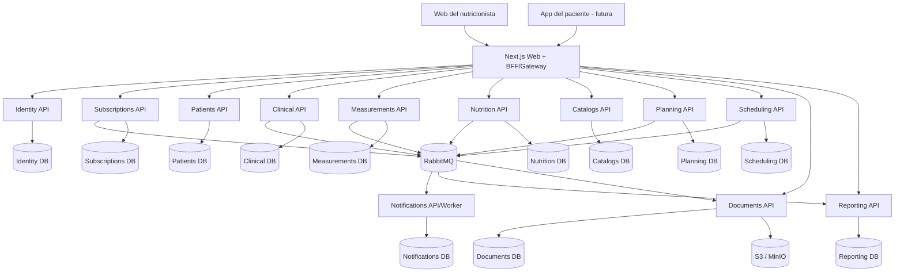
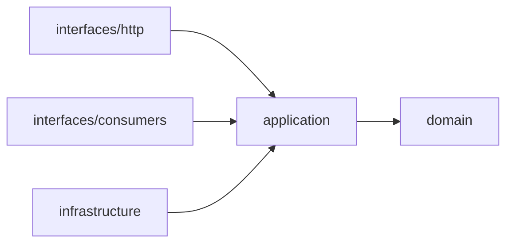
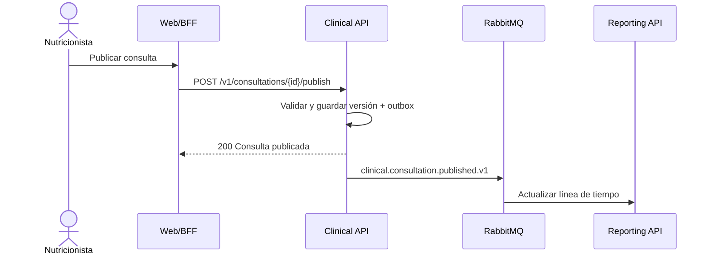

# Arquitectura completa de NUTRIMEJOR

## 1. Objetivo y principios

NUTRIMEJOR será una plataforma SaaS para nutricionistas con niveles Básica, Pro y
Sport. La separación se aplica por **contexto de negocio**, no por pantalla: cada
contexto con estado tiene su propia API y base de datos.

Reglas obligatorias:

1. Cada servicio es propietario exclusivo de su base de datos.
2. No existen consultas, claves foráneas ni transacciones entre bases de servicios.
3. La integración síncrona usa APIs versionadas; la propagación asíncrona usa eventos.
4. Las reglas viven en `domain` y `application`, no en controladores ni SQL.
5. Los registros clínicos publicados son inmutables y auditables.
6. Los identificadores son UUID y las fechas se guardan en UTC.
7. Toda autorización considera organización, usuario, rol y plan contratado.
8. La IA futura genera borradores que requieren aprobación profesional.

## 2. Vista general



El BFF conserva la cookie segura y adapta las respuestas para la interfaz. No contiene
reglas clínicas. Al inicio también cumple el papel de API Gateway; se separará cuando
el tráfico o las aplicaciones cliente lo justifiquen.

## 3. Tecnología objetivo

| Área | Decisión |
| --- | --- |
| Web/BFF | Next.js 15, React 19, TypeScript, Zod |
| APIs | Node.js 22, TypeScript, REST JSON, Zod |
| Persistencia | SQL Server 2022; base lógica y credencial por servicio |
| Mensajería | RabbitMQ, colas durables, reintentos y dead-letter queue |
| Archivos | Adaptador de sistema de archivos local; almacenamiento S3 en producción |
| Caché | Redis cuando se necesite caché, rate limit o datos efímeros |
| Contratos | OpenAPI 3.1 para HTTP y AsyncAPI para eventos |
| Observabilidad | OpenTelemetry, Prometheus/Grafana y logs estructurados |
| Pruebas | `node:test` o Vitest, contratos e integración con SQL real |

Los servicios existentes pueden funcionar en JavaScript durante la transición. Los
nuevos se crean en TypeScript y los existentes se migran antes de ampliar su dominio.

## 4. Servicios y datos propios

### Identity API

Cuentas, credenciales, organizaciones, miembros, roles y sesiones.

- Tablas: `Organizations`, `Users`, `OrganizationMembers`, `Roles`,
  `RefreshSessions`, `PasswordResetTokens`, `AuditAccessEvents`.
- Firma JWT asimétricos de corta duración y publica `/.well-known/jwks.json`.
- Cada API valida el JWT localmente; Identity no participa en cada solicitud.

### Subscriptions API

Planes Básica, Pro y Sport, suscripciones, periodos, cuotas y derechos.

- Tablas: `Plans`, `Features`, `PlanFeatures`, `Subscriptions`, `UsageCounters`,
  `BillingEvents`.
- No guarda tarjetas; solo identificadores del proveedor de cobro.
- Publica snapshots de derechos para evitar una consulta síncrona por operación.

### Patients API

Ficha administrativa, contactos, etiquetas, consentimientos, estado y profesionales
asignados. No almacena mediciones ni notas clínicas.

- Tablas: `Patients`, `PatientContacts`, `EmergencyContacts`,
  `PatientAssignments`, `PatientTags`, `Consents`.
- La edad se calcula desde `BirthDate`; no se guarda como dato mutable.
- El borrado normal es lógico y respeta la política de retención.

### Clinical API

Historia clínica, antecedentes, síntomas, medicamentos, suplementos, diagnósticos,
consultas, metas y seguimientos.

- Tablas: `ClinicalRecords`, `Consultations`, `ConsultationVersions`, `Conditions`,
  `FamilyHistory`, `Surgeries`, `Medications`, `Supplements`, `Symptoms`,
  `NutritionDiagnoses`, `ClinicalGoals`, `FollowUps`.
- Una consulta empieza como borrador. Publicarla crea una versión inmutable.
- Una corrección crea otra versión con autor, fecha y motivo.

### Measurements API

Antropometría, composición corporal, signos vitales y laboratorios.

- Tablas: `MeasurementSessions`, `AnthropometricMeasurements`,
  `SkinfoldMeasurements`, `CircumferenceMeasurements`, `DiameterMeasurements`,
  `BodyCompositionResults`, `VitalSigns`, `LabPanels`, `LabResults`,
  `FormulaDefinitions`, `CalculationResults`, `IsakEvaluatorProfiles`.
- Cada valor conserva unidad, método, equipo, fórmula y versión de fórmula.
- Los resultados calculados guardan sus entradas para poder reproducirse.
- ISAK 3 permanece desactivado hasta resolver su alcance y validación profesional.

### Nutrition API

Estilo de vida, evaluación dietética, recordatorio de 24 horas y frecuencia de consumo.

- Tablas: `LifestyleAssessments`, `DietaryAssessments`, `Recall24h`, `RecallMeals`,
  `RecallItems`, `FoodFrequencyAssessments`, `FoodFrequencyEntries`,
  `NutrientAnalysisSnapshots`.
- Los análisis guardan una fotografía de nutrientes y porciones. Un cambio posterior en
  Catalogs no altera un resultado histórico.

### Catalogs API

Alimentos, nutrientes, porciones, medidas caseras, recetas, preparaciones,
recomendaciones y material educativo.

- Tablas: `Foods`, `Nutrients`, `FoodNutrients`, `HouseholdMeasures`, `FoodPortions`,
  `Recipes`, `RecipeIngredients`, `RecipeNutrients`, `RecipeTags`,
  `Recommendations`, `EducationResources`.
- Cada registro tiene alcance global, organización o profesional.
- Los datos globales incluyen fuente, licencia y versión. El profesional personaliza
  una copia, sin modificar el original.

### Planning API

Requerimientos energéticos, objetivos nutricionales, distribución por comidas, planes,
menús, generadores y listas de compra.

- Tablas: `RequirementProfiles`, `EnergyCalculations`, `MacroTargets`,
  `NutrientTargets`, `MealDistributions`, `MealPlans`, `MealPlanVersions`,
  `MenuDays`, `MenuMeals`, `MenuItems`, `GeneratorConstraints`, `GeneratorRuns`,
  `ShoppingLists`.
- Los planes publicados son inmutables y versionados.
- Alergias, intolerancias, exclusiones y contraindicaciones son restricciones duras.
- El generador siempre entrega un borrador editable por el profesional.

### Scheduling API

Agenda, disponibilidad, citas, recordatorios y estados.

- Tablas: `Calendars`, `AvailabilityRules`, `Appointments`,
  `AppointmentStatusHistory`, `ReminderSchedules`.
- Estados: programada, confirmada, atendida, ausente, cancelada y reprogramada.
- Reprogramar conserva la fecha anterior en el historial.

### Notifications API y workers

Reglas de alerta, mensajes, preferencias y entregas por canal.

- Tablas: `AlertRules`, `NotificationTemplates`, `NotificationPreferences`,
  `NotificationJobs`, `DeliveryAttempts`.
- Correo, SMS, WhatsApp o push se implementan como adaptadores.
- Una falla de entrega no revierte una operación clínica.

### Documents API

Plantillas, PDF, identidad visual, firmas y archivos.

- Tablas: `DocumentTemplates`, `DocumentRequests`, `GeneratedDocuments`,
  `BrandProfiles`, `SignatureAssets`.
- Los binarios viven en almacenamiento de objetos; SQL guarda metadatos, hash,
  propietario, versión y ubicación.
- La generación es asíncrona y devuelve un identificador consultable.

### Reporting API

Dashboard, comparaciones y gráficos mediante modelos de lectura creados desde eventos.

- Tablas: `DashboardMetrics`, `PatientTimelineReadModel`,
  `PatientEvolutionReadModel`, `UpcomingWorkReadModel`, `ReportSnapshots`.
- Nunca consulta bases ajenas.
- Si falla, los servicios clínicos siguen registrando información; al recuperarse,
  reprocesa eventos.

## 5. Arquitectura limpia de cada servicio

```text
src/
  domain/
    entities/
    value-objects/
    policies/
    errors/
  application/
    use-cases/
    ports/
    dto/
  infrastructure/
    sql/
    messaging/
    external/
    observability/
  interfaces/
    http/
    consumers/
  bootstrap/
```



`domain` no importa HTTP, SQL o RabbitMQ. `application` define casos de uso y puertos.
`infrastructure` implementa esos puertos. `interfaces` traduce HTTP o eventos.
`bootstrap` crea conexiones e inyecta dependencias.

## 6. Contratos HTTP

Todas las rutas usan `/v1` y estas convenciones:

- JSON `camelCase`, fechas ISO 8601 UTC y UUID como texto.
- Paginación por cursor: `?limit=50&cursor=...`.
- Errores `application/problem+json` con código de dominio estable.
- `x-request-id` obligatorio y propagado.
- `Idempotency-Key` para citas, documentos, pagos y comandos reintentables.
- `ETag` o número de versión para controlar concurrencia.
- Límite de tamaño y campos permitidos por endpoint.

Ejemplo:

```json
{
  "type": "https://nutrimejor.app/problems/validation-error",
  "title": "Datos inválidos",
  "status": 400,
  "code": "PATIENT_BIRTH_DATE_INVALID",
  "requestId": "0d383a3c-1a58-4de8-87fb-22a6312e9e31",
  "errors": [{ "field": "birthDate", "message": "La fecha no puede ser futura." }]
}
```

Cada API publica `openapi.yaml`. Un cambio incompatible crea `/v2`; agregar un campo
opcional mantiene `/v1`.

## 7. Eventos e integridad distribuida

Formato común:

```json
{
  "eventId": "uuid",
  "eventType": "clinical.consultation.published.v1",
  "occurredAt": "2026-09-24T18:30:00Z",
  "organizationId": "uuid",
  "actorId": "uuid",
  "aggregateId": "uuid",
  "correlationId": "uuid",
  "data": {}
}
```

| Productor | Eventos iniciales | Consumidores |
| --- | --- | --- |
| Identity | `identity.member.changed.v1` | todos |
| Subscriptions | `subscription.entitlements.changed.v1` | BFF y APIs |
| Patients | `patient.created.v1`, `patient.status_changed.v1` | Clinical, Reporting |
| Clinical | `clinical.consultation.published.v1` | Reporting, Documents, Notifications |
| Measurements | `measurements.session.recorded.v1` | Clinical, Reporting |
| Nutrition | `nutrition.assessment.completed.v1` | Planning, Reporting |
| Planning | `planning.plan.published.v1` | Documents, Notifications, Reporting |
| Scheduling | `scheduling.appointment.changed.v1` | Notifications, Reporting |
| Documents | `documents.document.generated.v1` | BFF, Notifications |

Cada servicio usa transactional outbox, publicador, inbox idempotente, reintentos con
espera incremental y dead-letter queue. No se usan transacciones distribuidas. Un flujo
de varios servicios realiza transacciones locales y compensaciones explícitas.

## 8. Flujos principales

### Publicar consulta



### Generar plan y PDF

1. Planning recibe objetivos, restricciones y referencias publicadas.
2. Consulta Catalogs para alimentos o recetas vigentes.
3. Guarda un borrador con la versión de cada referencia usada.
4. El profesional revisa y publica una versión inmutable.
5. `planning.plan.published.v1` solicita el documento a Documents.
6. Documents genera el PDF y publica `documents.document.generated.v1`.

## 9. Seguridad y datos clínicos

- JWT asimétrico, expiración corta y renovación rotatoria.
- Cookie web `HttpOnly`, `Secure` y `SameSite=Lax`.
- Autorización por organización y recurso en cada caso de uso.
- Roles iniciales: propietario, administrador, nutricionista y asistente.
- El asistente no lee notas clínicas ni publica diagnósticos.
- TLS en tránsito y cifrado administrado para bases, backups y archivos.
- Secretos fuera del repositorio y rotación por ambiente.
- Auditoría de acceso a pacientes, exportaciones, permisos y documentos.
- Rate limiting, protección contra fuerza bruta y bloqueo temporal.
- Logs sin contraseñas, tokens, diagnósticos, notas o laboratorios.
- Exportación y eliminación sujetas a consentimiento y retención.

Antes de producción se define la normativa del país y se aprueban las políticas de
consentimiento, retención, respaldo y respuesta a incidentes.

## 10. Membresías

La protección se aplica también en las APIs mediante funciones como:

- `patients.manage`
- `clinical.basic`
- `measurements.basic`
- `measurements.advanced`
- `measurements.isak`
- `nutrition.recall.analysis`
- `planning.menu.generator`
- `documents.custom_branding`
- `scheduling.manage`
- `reporting.advanced`

Las cuotas se registran de forma idempotente. Bajar de plan no borra datos; impide crear
nuevos recursos o ejecutar funciones que ya no están contratadas.

## 11. Resiliencia

- Timeout obligatorio en llamadas salientes.
- Reintentos solo para operaciones idempotentes.
- Circuit breaker en dependencias inestables.
- Pools SQL limitados por réplica.
- Colas para PDF, notificaciones, métricas y trabajos lentos.
- Backpressure y límite de tamaño de solicitudes.
- `/health/live` y `/health/ready` separados.
- Migraciones compatibles hacia adelante y despliegues graduales.
- Backups automáticos y ensayos periódicos de restauración.

Para registrar una consulta solo se requieren token válido, Patients, Clinical y su base.
Reporting, PDFs, agenda o notificaciones pueden fallar sin impedir el registro clínico.

## 12. Observabilidad

Los logs incluyen `timestamp`, `level`, `service`, `environment`, `requestId`,
`correlationId`, organización anonimizada, ruta, estado y duración. Las métricas mínimas
son latencia p50/p95/p99, tasa de error, conexiones SQL, consultas lentas, profundidad
de colas, dead letters, generación de documentos y retraso de proyecciones.

Las alertas se basan en síntomas: errores, latencia, colas acumuladas, espacio de base y
fallos de backup. Los trazos distribuidos comparten `correlationId`.

## 13. Desarrollo local y producción

Docker Compose se divide por perfiles:

- `core`: web, identity, subscriptions, patients y clinical.
- `nutrition`: measurements, nutrition, catalogs y planning.
- `operations`: scheduling, notifications, documents y reporting.
- `infra`: RabbitMQ, Redis y observabilidad.

Cada servicio mantiene una base separada. En computadoras limitadas, varias bases
lógicas pueden vivir en una instancia SQL Server local con usuarios distintos. En
producción, las bases de mayor carga se alojan en instancias separadas. Compartir una
instancia local nunca permite consultas entre bases.

Ambientes: `local`, `test`, `staging` y `production`. Cada imagen se construye una vez y
se promueve. En producción, las migraciones se ejecutan como trabajo previo al despliegue;
la API no modifica el esquema al arrancar.

## 14. Estrategia de pruebas

| Nivel | Verifica |
| --- | --- |
| Dominio | fórmulas, restricciones e invariantes |
| Aplicación | casos de uso con puertos simulados |
| Integración | SQL, migraciones, outbox e inbox |
| Contrato | OpenAPI y AsyncAPI entre servicios |
| API | autenticación, autorización, validación e idempotencia |
| Flujo | paciente → consulta → evaluación → plan → PDF → seguimiento |
| Resiliencia | dependencia caída, duplicados, timeout y reintento |
| Seguridad | aislamiento entre organizaciones, roles y archivos |

Las fórmulas clínicas requieren casos aprobados por un profesional y deben registrar
fuente, versión, unidades y redondeo.

## 15. Decisiones pendientes

1. Alcance de ISAK 1, 2 y 3.
2. Países, unidades, zona horaria, idioma y normativa aplicable.
3. Clínicas, equipos y pacientes compartidos.
4. Fuente y licencia de alimentos y nutrientes.
5. Precios, periodos, pruebas, cuotas y proveedor de cobro.
6. Canales de recordatorio y consentimiento.
7. Firma gráfica o firma digital certificada.
8. Retención y eliminación de información clínica.
9. Métodos y fórmulas autorizados y su validación profesional.

## 16. Transición desde el repositorio actual

Se reutilizan `identity-api`, `patients-api` y `catalogs-api` con estos cambios:

- Identity incorpora organizaciones, miembros, JWT asimétrico y JWKS.
- Patients conserva la ficha administrativa; `HistorialPaciente` migra a Clinical.
- Peso y altura migran de Patients a Measurements.
- Catalogs reemplaza la tabla genérica por entidades tipadas.
- Dietas y planes salen de Catalogs y pasan a Planning.
- El BFF amplía sus clientes y elimina la introspección de identidad por solicitud.
- Docker Compose incorpora perfiles y mensajería de manera incremental.

La secuencia concreta está en
[`IMPLEMENTATION_ROADMAP.md`](./IMPLEMENTATION_ROADMAP.md).
La cobertura del documento funcional se controla en
[`REQUIREMENTS_TRACEABILITY.md`](./REQUIREMENTS_TRACEABILITY.md).
