# Ruta de implementación de NUTRIMEJOR

Cada fase debe quedar operativa de extremo a extremo. No se inicia la siguiente si sus
criterios de terminación siguen pendientes.

## Fase 0 — Base técnica

**Objetivo:** convertir el prototipo en una plataforma repetible.

1. Verificar build, pruebas y Docker de los tres servicios actuales.
2. Crear una plantilla TypeScript con arquitectura limpia, configuración, errores,
   logs, health checks y cierre ordenado.
3. Publicar OpenAPI de Identity, Patients y Catalogs.
4. Separar migraciones versionadas del arranque de las APIs.
5. Añadir CI: typecheck, pruebas, build, contratos y Docker build.
6. Estandarizar `x-request-id`, errores y límites de conexiones/recursos.

**Termina cuando:** una instalación limpia se levanta con un comando, los contratos se
validan automáticamente y no hay secretos reales en el repositorio.

## Fase 1 — Identidad y organizaciones

**Objetivo:** soportar profesionales individuales y clínicas.

1. Modelar organizaciones, miembros, invitaciones y roles.
2. Migrar cada usuario existente a una organización personal.
3. Cambiar a JWT asimétrico, JWKS y renovación rotatoria.
4. Validar tokens localmente en cada API.
5. Añadir recuperación de contraseña y auditoría de acceso.
6. Implementar selector de organización en el BFF.

**Termina cuando:** dos organizaciones quedan aisladas, los roles tienen pruebas y una
caída breve de Identity no invalida un token vigente.

## Fase 2 — Membresías

**Objetivo:** establecer Básica, Pro y Sport antes de construir funciones bloqueables.

1. Crear `subscriptions-api` y `Subscriptions DB`.
2. Definir funciones y cuotas, inicialmente sin proveedor de pagos.
3. Asignar suscripción de prueba a organizaciones existentes.
4. Publicar snapshots de derechos y guardarlos como proyección local.
5. Aplicar permisos en API y web.
6. Probar subida, bajada, expiración y reactivación.

**Termina cuando:** las APIs protegen funciones y cuotas; bajar de plan conserva datos.

## Fase 3 — Pacientes

**Objetivo:** completar la ficha administrativa.

1. Añadir datos personales, emergencia, fotografía, etiquetas y estado.
2. Incorporar asignaciones y consentimientos.
3. Quitar peso, altura e historia clínica de Patients DB.
4. Añadir búsqueda, filtros, cursor y detección de duplicados.
5. Publicar eventos de alta, asignación y cambio de estado.

**Termina cuando:** la ficha está autorizada por organización, existe historial
administrativo y no se crean datos clínicos nuevos en Patients DB.

## Fase 4 — Historia clínica y consultas

**Objetivo:** implementar el núcleo clínico versionado.

1. Crear `clinical-api` y `Clinical DB`.
2. Modelar antecedentes, problemas, síntomas, cirugías, medicamentos y suplementos.
3. Implementar consulta inicial, seguimiento, reconsulta, control y cierre.
4. Implementar borrador, publicación y corrección versionada.
5. Añadir diagnóstico nutricional y objetivos por consulta.
6. Migrar `HistorialPaciente` conservando origen y fecha.
7. Construir la línea de tiempo clínica básica.

**Termina cuando:** una consulta publicada no se sobrescribe y se puede reconstruir
quién cambió qué, cuándo y por qué.

## Fase 5 — Mediciones y bioquímica

**Objetivo:** cubrir la evaluación clínica básica.

1. Crear `measurements-api` y `Measurements DB`.
2. Implementar peso, altura, IMC, cintura, cadera, brazo e índice cintura-cadera.
3. Implementar signos vitales y paneles de laboratorio.
4. Migrar peso y altura existentes.
5. Registrar método, equipo, unidad, autor y fecha.
6. Crear comparación inicial/actual con cambio absoluto y porcentual.

**Termina cuando:** las sesiones son auditables, las unidades incompatibles se rechazan
y los resultados históricos son reproducibles.

## Fase 6 — Alimentos y recetas

**Objetivo:** reemplazar el catálogo genérico por información estructurada.

1. Acordar fuente y licencia del catálogo global.
2. Modelar alimentos, nutrientes, porciones y medidas caseras.
3. Modelar recetas, ingredientes, rendimiento y cálculo nutricional.
4. Añadir etiquetas y alcance global/organización/profesional.
5. Modelar recomendaciones y material educativo.
6. Migrar registros útiles de `Catalogos`.

**Termina cuando:** una receta calcula nutrientes desde ingredientes versionados y las
copias profesionales no modifican el catálogo global.

## Fase 7 — Evaluación dietética

**Objetivo:** registrar hábitos y calcular la ingesta observada.

1. Crear `nutrition-api` y `Nutrition DB`.
2. Implementar estilo de vida y evaluación alimentaria.
3. Implementar recordatorio de 24 horas por comidas e ingredientes.
4. Calcular energía, macros, fibra y micronutrientes.
5. Implementar frecuencia de consumo para Pro.
6. Guardar snapshots y publicar evaluación completada.

**Termina cuando:** editar después un alimento no cambia el análisis histórico y cada
cálculo puede rastrearse hasta cantidades, unidades y fuente.

## Fase 8 — Requerimientos y planes

**Objetivo:** cerrar evaluación → requerimientos → plan.

1. Crear `planning-api` y `Planning DB`.
2. Registrar fórmulas con fuente, versión, unidades y redondeo.
3. Implementar GEB, actividad, ETA, GET y metas de macronutrientes.
4. Implementar distribución por comidas, días, planes y menús versionados.
5. Comparar aporte con objetivo.
6. Aplicar alergias, intolerancias, exclusiones y contraindicaciones.

**Termina cuando:** los cálculos son reproducibles, los planes publicados se conservan
y nunca se propone un alimento contraindicado.

## Fase 9 — Seguimiento y evolución

**Objetivo:** mostrar evolución sin consultar bases operativas ajenas.

1. Incorporar RabbitMQ, outbox e inbox.
2. Crear `reporting-api` y `Reporting DB`.
3. Construir línea de tiempo y comparación inicial/actual.
4. Crear gráficos de peso, IMC, composición, perímetros y laboratorios.
5. Crear dashboard de consultas, pendientes, alertas y datos incompletos.
6. Permitir reconstruir todas las proyecciones desde eventos.

**Termina cuando:** Reporting puede reconstruirse, tolera duplicados y su caída no
bloquea operaciones clínicas.

## Fase 10 — Agenda y notificaciones

**Objetivo:** organizar consultas y seguimientos automáticos.

1. Crear `scheduling-api`, `notifications-api` y sus bases.
2. Implementar disponibilidad, citas, cancelación y reprogramación.
3. Implementar alertas por seguimiento, vencimiento y datos pendientes.
4. Elegir el primer canal de entrega.
5. Añadir preferencias y consentimiento por canal.
6. Añadir reintentos y dead-letter queue.

**Termina cuando:** la agenda conserva el historial y una entrega fallida se reintenta
sin duplicar mensajes.

## Fase 11 — PDF y documentos

**Objetivo:** producir documentos profesionales reproducibles.

1. Crear `documents-api`, `Documents DB` y el adaptador de archivos local/S3.
2. Implementar marca, logotipo y plantillas.
3. Generar planes, recomendaciones, evolución e informes seleccionables.
4. Guardar hash, versión, solicitante y fuente de datos.
5. Aplicar URLs temporales y autorización por organización/paciente.

**Termina cuando:** la generación es asíncrona e idempotente y ningún usuario accede a
un documento sin acceso al paciente.

## Fase 12 — Automatización Pro

**Objetivo:** automatizar manteniendo revisión profesional.

1. Implementar generador de menús por restricciones y objetivos.
2. Añadir adecuación porcentual y control de micronutrientes.
3. Añadir sustituciones, equivalencias y lista de compras.
4. Añadir plantillas avanzadas y biblioteca educativa.
5. Registrar ejecución, restricciones, resultado y cambios manuales.

**Termina cuando:** el generador explica restricciones, permite editar antes de publicar
y supera pruebas de alergias, exclusiones y límites.

## Fase 13 — Sport

**Objetivo:** habilitar la membresía deportiva sobre el núcleo estable.

1. Resolver alcance ISAK 1, 2 y 3.
2. Añadir pliegues, diámetros, longitudes, segmentos y perfiles del evaluador.
3. Implementar fórmulas deportivas, hidratación y cálculos por kilogramo.
4. Crear biblioteca pre, intra y post entrenamiento.
5. Implementar generador Sport y etiquetas especializadas.
6. Validar fórmulas y casos con un profesional acreditado.

**Termina cuando:** cada medición identifica protocolo, lado, evaluador y equipo, y los
casos de referencia están aprobados.

## Fase 14 — Producción

**Objetivo:** desplegar con controles operativos y de seguridad.

1. Revisar amenazas y aislamiento multi-organización.
2. Configurar secretos, TLS, dominios y políticas de red.
3. Activar métricas, trazas, paneles y alertas.
4. Automatizar backups y ensayar restauración por servicio.
5. Ejecutar pruebas de carga y recuperación de colas.
6. Documentar incidentes, despliegue, reversión y soporte.
7. Aprobar privacidad, consentimiento y retención aplicables.

**Termina cuando:** cada base y archivo puede restaurarse, los objetivos operativos están
medidos y no quedan vulnerabilidades críticas abiertas.

## Fase 15 — Futuro

La aplicación del paciente y la asistencia con IA comienzan cuando existen datos de
calidad, auditoría y reglas clínicas validadas. La IA solo produce sugerencias, resúmenes
y borradores con contexto rastreable y aprobación profesional.

## Orden resumido

```mermaid
flowchart LR
  F0[0 Plataforma] --> F1[1 Identidad] --> F2[2 Membresías]
  F2 --> F3[3 Pacientes] --> F4[4 Clínica] --> F5[5 Mediciones]
  F5 --> F6[6 Catálogos] --> F7[7 Evaluación] --> F8[8 Planificación]
  F8 --> F9[9 Evolución] --> F10[10 Agenda] --> F11[11 PDF]
  F11 --> F12[12 Pro] --> F13[13 Sport] --> F14[14 Producción] --> F15[15 Futuro]
```

La primera entrega útil para pruebas con nutricionistas termina en la fase 8. Las fases
9 a 11 completan el producto Básico operable; Pro y Sport se construyen después.
